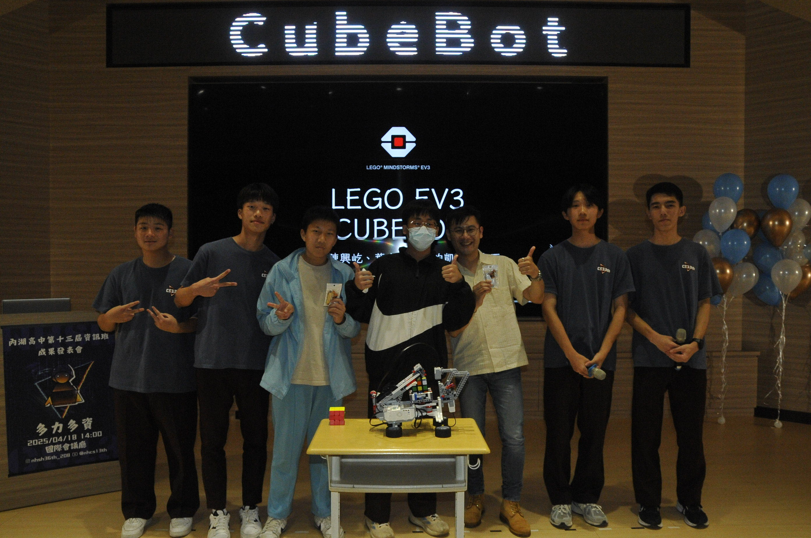
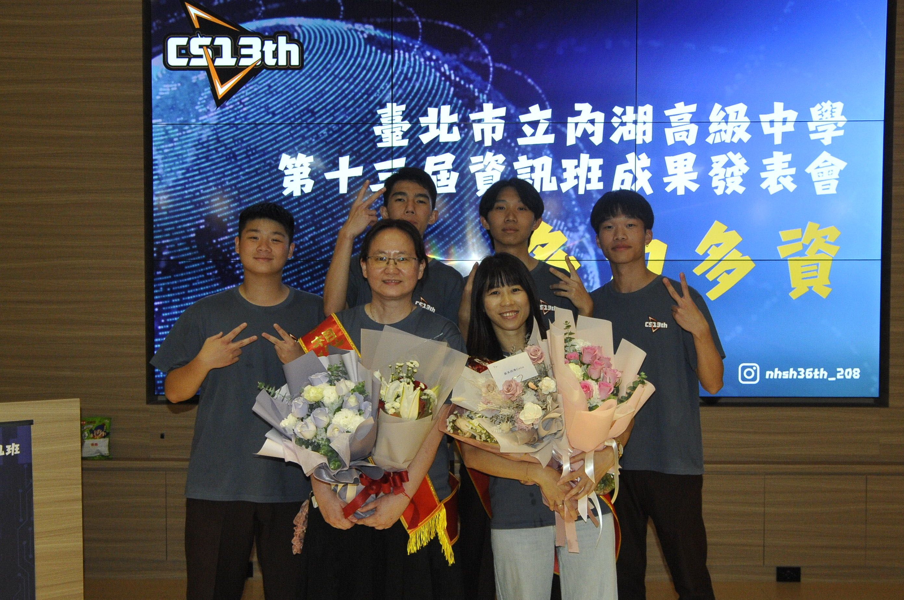

回首高二這一年，最讓我難忘的絕對是四月十八號舉辦的那場「成果發表會」。這不僅僅是一次課程的作業報告，更是我們準備了整整半年的大型活動。從分組時的無奈、製作過程的卡關、擔任幹部的繁瑣行政，到最後上台的驚險瞬間，這段過程就像坐雲霄飛車一樣刺激。以下我將依照五個階段，完整回顧這段笑淚交織的回憶。

## 一、 專題分組挑戰與魔術方塊機器人選題
故事要從高二升高三的暑假說起。當時我們必須決定專題的分組，老師指定由成績較好的同學擔任組長，我很榮幸、卻也有些無奈地被選上了。因為班上其他的技術強者都已互相組隊，最後分到我這組的隊員，坦白說，是幾位比較缺乏責任感且能力稍弱的同學。當時我心裡感到晴天霹靂，覺得這下專題可能要完蛋了。

為了不讓進度「開天窗」，我決定採取保守策略。我選擇了網路上已有現成程式碼和組裝教學的「樂高 EV3 魔術方塊機器人」。當時我的算盤是：既然隊員可能幫不上忙，我就找一個自己一個人也能搞定、而且看起來很酷的題目。這樣即便他們不動手，我也能確保專題可以順利完成。

## 二、 專題製作卡關與關鍵器材規格之解決
雖然策略看似周全，但執行起來卻困難重重。首先是硬體零件的短缺，因為廠商忘記出貨加上颱風攪局，零件一直拖到十一月才到齊。最可怕的是，當我們終於把機器人組好、灌入程式後，發現機器人完全動不了！它始終卡在掃描顏色的步驟，不斷顯示錯誤訊息。因為核心程式碼並非我親手所寫，我根本無從修起，那段時間我焦慮到不行，甚至擔心寒假是否得被迫更換題目。

直到寒假，我不死心地把機器人帶回家，在爸爸的協助下一起鑽研說明書。最後我們發現一個驚人的細節：原來這套程式對魔術方塊的「品牌」有特定要求！不同品牌的方塊，顏色深淺與色調略有不同，機器人會因此無法辨識。我們隨即跑遍各大玩具店，終於買到了指定品牌的魔術方塊。一放上去，機器人真的成功開始轉動了！那一刻，我的進度瞬間從 50% 飆升到將近 100%，那種如釋重負的感覺，真的讓我過了一個好年。

## 三、 副召集人職務與成果發表會行政籌備
除了負責自己的專題，我還擔任了這次成發的「副召集人」。這份工作比我想像中繁雜許多，因為我們是未成年學生，在向廠商租借聚光燈、音響等專業器材時，簽署合約變得非常麻煩，常常需要拜託家長幫忙。此外，我們還要負責設計海報、邀請函，甚至發揮創意想出了一個諧音梗叫做「多利多資（資訊）」，特別買了該品牌的餅乾當點心，還訂製了印有活動 LOGO 的 32GB 隨身碟作為有獎徵答的禮物。

活動前幾週，我和總召集人幾乎天天都在盯進度、排流程，還要不斷向任課老師借課來進行彩排。為了確保每位同學都能進入狀況，我們還製作了詳細的簡報來分配工作任務。那段時間每天都在熬夜修改細節，累到覺得身體都已經不是自己的了。

彩排時的照片：

## 四、 現場演示失誤之臨場應變與中場雪恥
終於到了四月十八號活動當天。早上我們忙著布置場地氣球，甚至連吃午餐的時間都沒有。下午一點活動正式展開，當我和總召站在舞台中央致詞時，看著台下近百位家長與老師，我緊張到鞠躬時身體都在發抖，拼命壓抑情緒才把講稿念完。

輪到我們這組上台報告時，前半段講解都很順利，直到進入「現場演示」的環節。我自信滿滿地按下開始鍵，結果——機器人竟然毫無反應！事後推測，可能是舞台燈光太強，干擾了顏色感應器的判斷，導致它連掃描程序都無法啟動。當下全場空氣凝結，我心裡想著「這下徹底完蛋了」。但在那一瞬間，我硬著頭皮拿起麥克風圓場：「這台機器人今天可能跟我們一樣太緊張，失常了。我們會在休息時間把它修好，等一下再秀給大家看！」

幸運的是，一下台回到燈光正常的區域，機器人就恢復正常了。我們利用中場休息時間，成功在台下向大家演示了魔術方塊還原，算是把面子救了回來，完成了一次驚險的雪恥。

## 五、 觀眾票選結果揭曉與活動圓滿落幕
活動尾聲是緊張的觀眾票選環節。雖然我們的現場演示出了一點小意外，但或許是因為題材有趣，加上後來的積極補救，我們這組最後順利拿到了前三名（名次雖有些模糊，但確定名列前茅）。這對我來說已經是非常大的肯定。

晚上八點，當我們把所有器材歸位、清理完場地後，我和幾個好朋友一起去吃了慶功宴。回想這半年，從起初對隊友感到絕望，到器材卡關的焦慮，再到擔任副召的疲憊，以及最後台上驚心動魄的救場。這場成果發表會雖然不完美，充滿了意外與挑戰，但它確實為我的高中生涯，畫下了一個最深刻、也最圓滿的句點。

小組合照：
