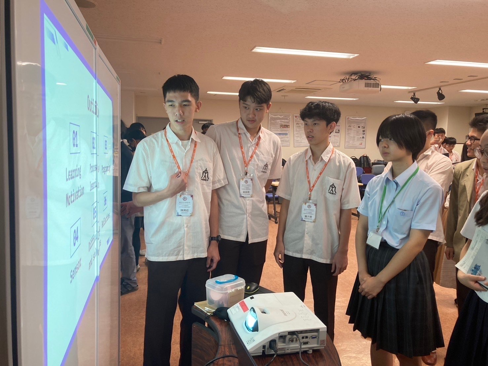
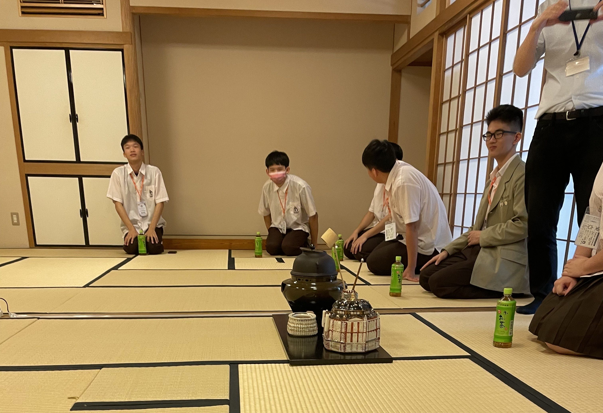
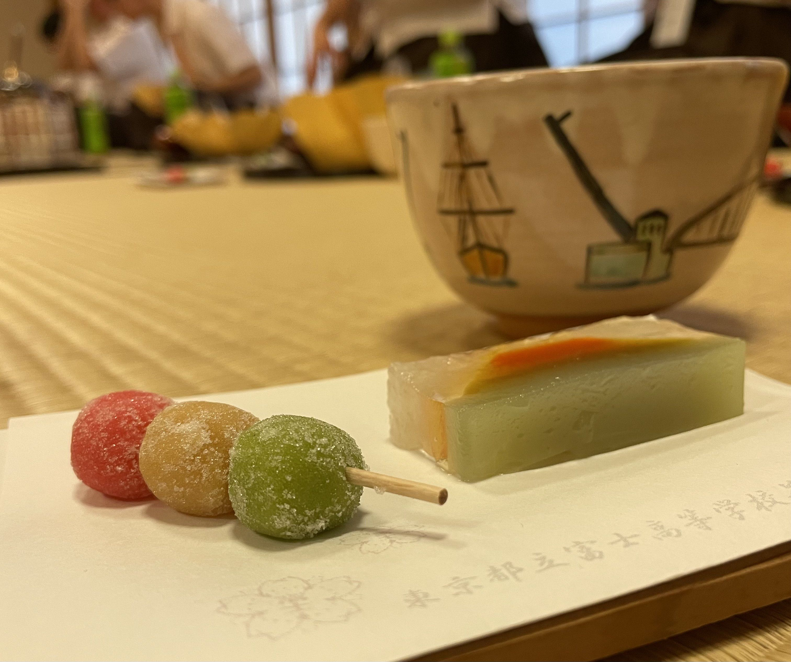
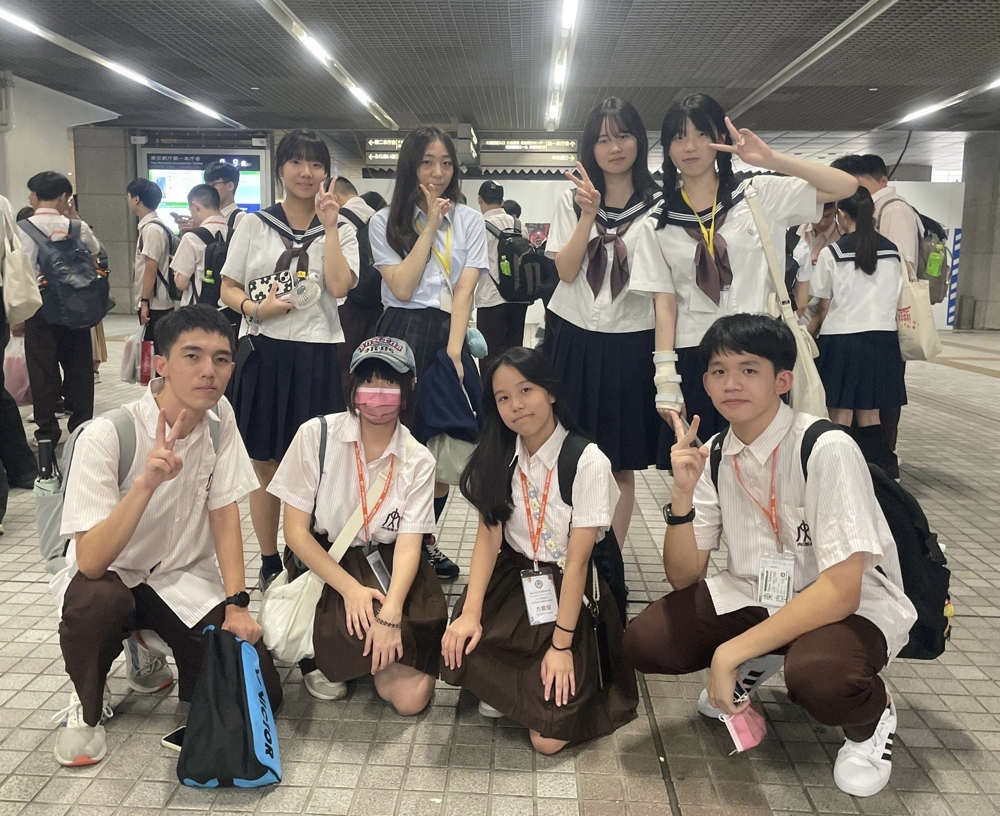

這次的日本教育旅行對我來說，不只是一次出國觀光，更是一場關於勇氣、交流與文化衝擊的成長之旅。這五天四夜的點點滴滴，我將其歸納為四個面向來分享。

## 一、 從技術到語言：將 EV3 專題譯向國際
一切的起點，其實是從五月的資通訊大賽開始的。當時我們投入大量心力在 LEGO EV3 機器人 的循跡與避障專題上。為了能在七月的日本行分享這個成果，我們必須把複雜的除錯經驗與比賽過程，轉化為全英文簡報。

這對我們來說是一項大工程。除了要確保專業名詞精確，更要練習如何流暢表達，因為擔心英文不夠流利，我們幾乎是用「死背」的方式記下每一頁內容。從五月到七月，在老師密集的訓練下，我們對內容已滾瓜爛熟，這份紮實的準備，成為了後來成功交流的底氣。

## 二、 富士高校交流：跨越國界的共鳴
抵達東京後的第二天，我們前往富士高校進行交流。雖然出發前和在飯店時仍不斷抓緊時間練習，但真正站上講台面對日本同學時，心裡依然充滿緊張。

交流過程中，我們這組的三位台灣學生與五位日本學生圍成一圈，用英文分享我們的機器人專題。雖然對方的科技內容細節我已模糊，但我深刻記得那種「努力理解彼此」的氛圍。即便語言有隔閡，但雙方充滿熱情的眼神與互動，成為了這趟旅程中最珍貴的時刻。

我努力將內心的想法傳達給日本同學中：

## 三、 茶道初體驗：意志力與跪坐的挑戰
在正式的學術發表後，不知不覺已經到了午餐時間，我們體驗了傳統的日本茶道，走進鋪滿榻榻米的和室，莊重的氣氛讓人肅然起敬。然而，這卻成了我身體上最大的考驗。

依照禮儀，我們必須全程「跪坐」。對於習慣坐椅子的我們來說，才過一分鐘，雙腳就開始發麻刺痛，在腳麻到不行的情況下還要優雅品茶，真的是意志力的磨練。幸好日本同學非常體貼，看我們面露難色，便告訴我們可以改為盤腿坐。當我把腳伸直的那一刻，那種如釋重負的感覺，比抹茶的味道還要令人難忘。

大家都痛苦的跪坐著：

體驗茶道的點心：

## 四、 城市探索：台日生活文化的微觀察
下午的行程轉為輕鬆的城市探索。我們與日本學員分組，一起遊覽了壯觀的明治神宮，感受從鳥居走入宮殿的莊嚴美感。接著我們轉往表參道，在那裡發生了一個有趣的小插曲。

我們看到台灣品牌「幸福堂」珍珠奶茶，忍不住買了一杯，明明飲料的味道都差不多，沒想到在日本一杯竟要價將近五百日幣，這讓我們對台日的物價差異有了深刻體會。在和日本同學把握了最後的相處時間後，我們到東京都廳的展望台集合，並且拍下大合照。雖然相處時間短暫，但在道別的那一刻，內心充滿了充實與不捨。

和日本同學的合照：

## 結語
這場旅程的起點是五月為了 EV3 競賽反覆除錯的深夜，終點則是帶回滿滿的國際視野。從前期死背英文稿的焦慮，到現場與日本學伴交流的熱忱，再到茶道體驗與城市探索所帶來的文化衝擊，每一段經歷都讓我明白：跨國溝通的核心不在於完美的文法，而在於那份願意理解彼此的真誠。這五天四夜不僅讓我學會如何將技術成果推向國際，更在挑戰與歡笑中磨練出應對未知的韌性，成為我高中生涯中最深刻且獨特的成長印記。