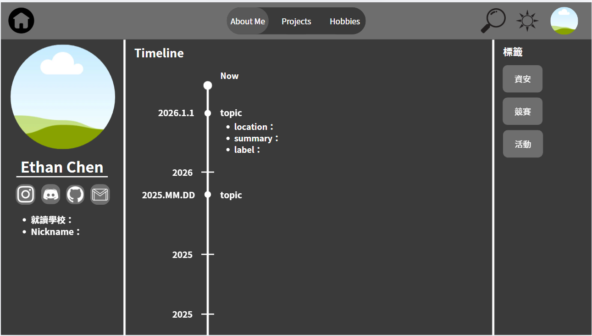

製作一個屬於自己的個人網站，是我從高三上學期就萌生的夢想。然而，這條路並非一帆風順，從硬體設備的限制、考試的壓力，到技術門檻的跨越，這段歷程充滿了挑戰與學習。以下我將透過五個階段，詳細回顧這段從無到有的實作過程。

## 一、個人網站建置契機與前置準備
早在半年前（2025年7月），我就希望能製作個人網頁，但當時礙於舊電腦效能不足，難以流暢執行 VSCode 等開發軟體，加上面臨學測的沉重壓力，這個計畫只能暫時擱置，直到一月考完試、換了新電腦後，我才終於具備了實質動工的條件。

起初，我對於 VSCode 和 GitHub 等工具感到非常陌生，網路上也缺乏適合純新手的完整教學，我也曾向有經驗的同學請教，他們建議直接套用網路上的「模板」最為快速，但我實際操作後發現，現成模板的程式碼結構極其複雜，光是修改一個區塊就得在三、四個檔案間頻繁切換，對於毫無基礎的我來說，解讀他人代碼反而比自己重頭寫還要困難。因此，我決定先暫緩網頁製作，改從基礎實作打起。

## 二、透過實作小型專案熟悉開發工具
為了熟悉開發環境，我決定從自己感興趣的 Discord 領域下手，製作一個 Discord 機器人。我跟著網路教學影片，堅持把每一行程式碼都親手打過一遍，確保自己能理解運作邏輯，而不僅僅是複製貼上。在這之後，我又挑戰了第二個專案，一個在桌面運行的「桌寵」小程式。

在這個階段，我開始大量運用 AI 來輔助學習。我會先詢問 AI 整體的製作流程，再針對每個細節步驟請教程式碼。這個過程讓我對 VSCode 和 GitHub 的操作愈發熟練，甚至成功將「桌寵」程式上傳並公開。有趣的是，同學看到我 GitHub 的更新後問起我的近況，這句話重新點燃了我製作個人網站的決心。這兩個小型專案的成功，成為了我挑戰製作個人網站的重要基石。

## 三、網站架構規劃與 UI 介面設計
在正式動手寫網頁程式之前，我先花了兩天時間進行深入規劃。我不希望依賴現成模板，因為我不想要一個大眾化的網站，我渴望打造出完全屬於自己的風格。我參考了許多優秀的個人網站，將喜歡的元素（如時間軸、特殊的貼文呈現方式）一一記錄下來。

接著，我拿出白紙畫出草圖，規劃了四個主要頁面：「主頁面」、「關於我」、「專案作品」以及「興趣愛好」：
- About Me： 左側放置履歷與頭貼，中間則是自動化的經歷時間軸。
- Projects： 集中展示我參與的各項活動與作品集。
- Hobbies： 採用圖像化按鈕的方式直觀呈現。

確定架構後，我利用 Canva 將手繪草圖轉化為彩色的使用者介面（UI）設計稿，這讓我對網站的最終樣貌有了清晰的視覺藍圖。

我在Canva畫的草圖：

## 四、AI 輔助程式碼生成與功能實作
進入實作階段後，我發展出了一套與 AI協作的獨特模式。由於 AI 有時無法直接精準辨識圖片內容，我會將 Canva 的設計圖截圖傳給 AI，請它先用文字描述圖片內容，我再針對描述進行修正，確認細節無誤後，才請 AI 根據描述生成對應的程式碼。

而這個方法極其有效，讓我逐步完成了四個頁面的基礎建設。AI 甚至幫我優化了按鈕的互動效果，節省了大量的開發時間。為了提升視覺吸引力，我還找了一個「星空背景」的特效程式碼，請 AI 協助整合，讓滑鼠滑過時星星會隨之散開，增加了互動的趣味性。

在功能面上，我特別設計了「自動化讀取」機制。例如在「時間軸」頁面，我不需要手動輸入每一條經歷，程式會自動讀取我的貼文標題或特定的文字檔來生成內容，大幅降低了未來維護網站的繁瑣程度。

## 五、網站部署上線與圖檔路徑除錯
網站架構完成後，我將過去參加過的所有活動用錄音的方式記錄下來，再利用錄音轉文字的方式快速產出內容文案，準備將網站部署上線。我使用 Vercel 連結 GitHub 進行部署，過程雖然順利，但網站一上線，我卻發現所有的圖片都變成了無法顯示的「破圖」。

經過反覆檢查，我才發現問題出在「路徑設定」。我在本機開發時，使用的是電腦內的「絕對路徑」，例如 C 槽中的資料夾，但網頁部署後，伺服器無法存取我個人電腦裡的檔案，必須改為「相對路徑」。

在修正過程中，我因為對檔案位置的理解偏差，加上免費版 AI 的額度用盡，一度陷入溝通困難的挫折中。直到某天洗澡時靈光一閃，突然想通了相對位置的邏輯錯誤，我趕緊修正代碼並重新部署，圖片終於成功顯示，那一刻的成就感難以言喻。這樣網站也完成了 90%，這段從無到有的旅程，不僅讓我擁有了一個專屬空間，更證明了只要善用工具並堅持思考，初學者也能突破技術的高牆。